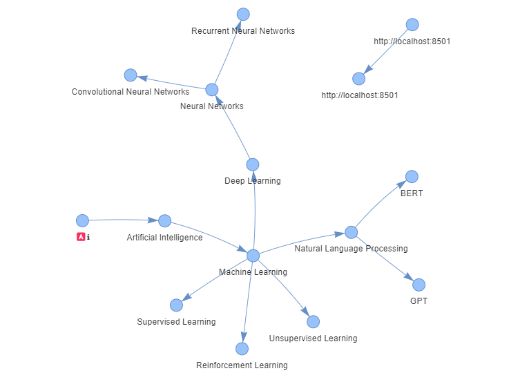

# Mind Map App

I've tried different variations of mind map app in this project.

1. Creating Mind mapp using forms in Streamlit
2. Automatic generation of mind map using a csv file
3. Simple Python mind map app to generate a visualization in MatplotLib

## How to create separate python environment

Creating a separate Python environment is a good way to isolate dependencies and manage different project requirements. You can use tools like `venv` (built into Python) or `conda` (if you're using Anaconda). Here's how you can create an environment using both methods.

---

### Option 1: Using `venv` (Python’s built-in environment tool)

#### Step 1: Install `venv`
`venv` comes with Python (version 3.3+), so no need to install anything extra. Verify your Python version using:

```bash
python --version
```

#### Step 2: Create a Virtual Environment
Open your terminal or command prompt and navigate to your project directory. Run the following command:

```bash
python -m venv myenv
```
- `myenv` is the name of your environment, but you can name it anything you like.

#### Step 3: Activate the Virtual Environment

- **On Windows:**
  ```bash
  myenv\Scripts\activate
  ```

- **On macOS/Linux:**
  ```bash
  source myenv/bin/activate
  ```

You should see the environment name in your terminal prompt, like this:
```
(myenv) C:\YourProject>
```

#### Step 4: Install Packages
Now you can install packages into this environment without affecting your global Python setup:

```bash
pip install streamlit networkx pyvis
```

#### Step 5: Deactivate the Environment
When you're done, you can deactivate the virtual environment by running:

```bash
deactivate
```

---

### Option 2: Using `conda` (Anaconda/Miniconda)

If you prefer using `conda`, here's how you can do it.

#### Step 1: Install Anaconda or Miniconda
- If you don’t have it installed, download and install [Miniconda](https://docs.conda.io/en/latest/miniconda.html) or [Anaconda](https://www.anaconda.com/products/individual).

#### Step 2: Create a Conda Environment
Run the following command in your terminal or command prompt to create a new environment:

```bash
conda create --name myenv python=3.9
```
Here, `myenv` is the environment name, and `python=3.9` specifies the Python version.

#### Step 3: Activate the Environment
- **On Windows/macOS/Linux:**
  ```bash
  conda activate myenv
  ```

#### Step 4: Install Packages
Once the environment is activated, you can install packages:

```bash
conda install streamlit networkx pyvis
```

Or, use `pip` within your `conda` environment:

```bash
pip install streamlit networkx pyvis
```

#### Step 5: Deactivate the Environment
To deactivate the conda environment:

```bash
conda deactivate
```

---

### Verify the Environment is Working
After creating and activating your environment, you can check which Python and packages are in use by running:

```bash
which python  # macOS/Linux
where python  # Windows
```

This should show the path to the Python executable inside your virtual environment.

---
### Examples of the generated mind maps


